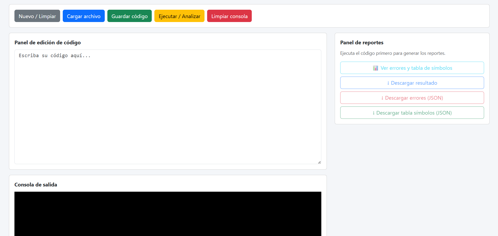
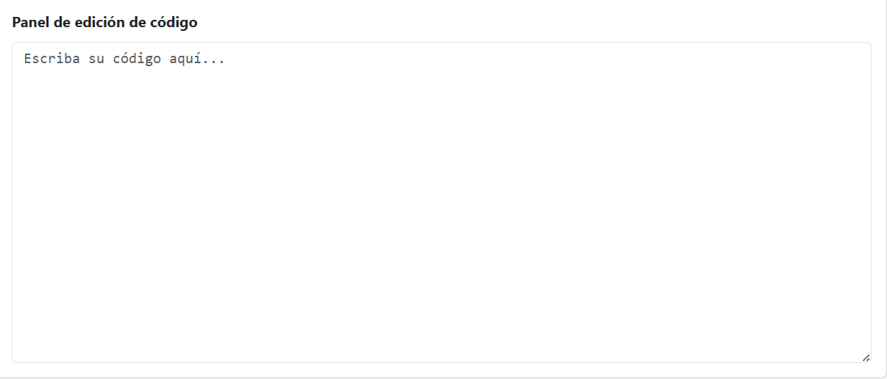
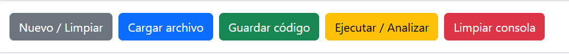
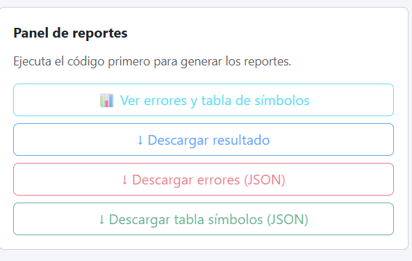
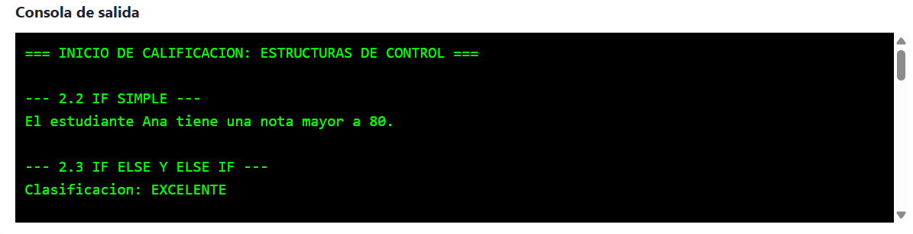
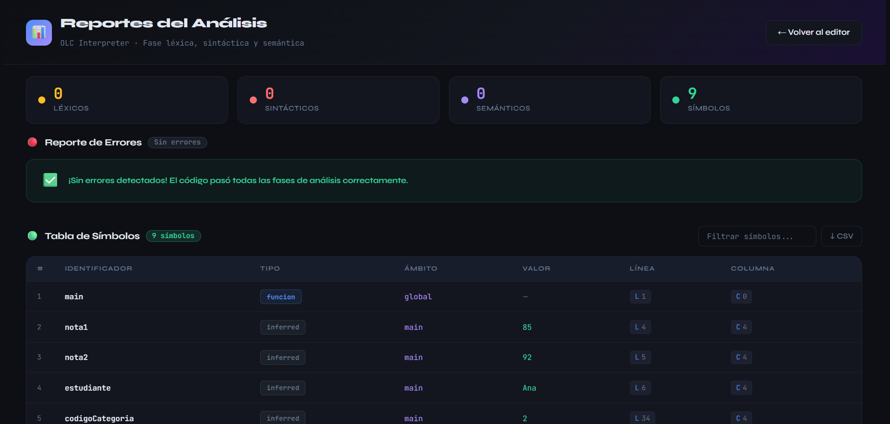
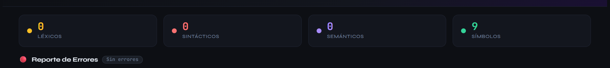
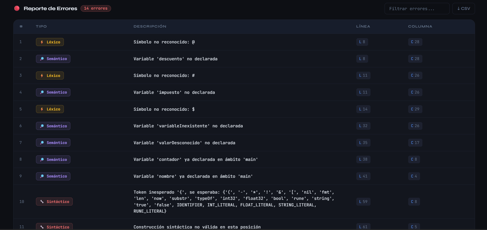
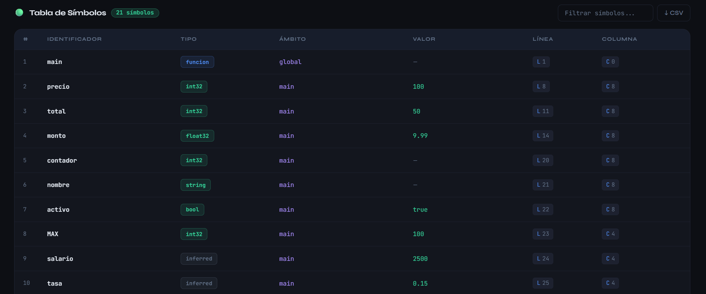

# Manual de Usuario — Intérprete Golampi

> **Versión:** 1.0 · **Plataforma:** Web (Laravel) · **Lenguaje interpretado:** Golampi

---

## Tabla de Contenidos

1. [Introducción](#1-introducción)
2. [Acceso al Sistema](#2-acceso-al-sistema)
3. [Vista Principal — Editor](#3-vista-principal--editor)
   - 3.1 [Imagen General del Sistema](#31-imagen-general-del-sistema)
   - 3.2 [Editor de Texto](#32-editor-de-texto)
   - 3.3 [Barra de Botones Principales](#33-barra-de-botones-principales)
   - 3.4 [Consola de Salida](#34-consola-de-salida)
4. [Vista de Reportes](#4-vista-de-reportes)
   - 4.1 [Imagen General de Reportes](#41-imagen-general-de-reportes)
   - 4.2 [Barra de Estadísticas](#42-barra-de-estadísticas)
   - 4.3 [Tabla de Errores](#43-tabla-de-errores)
   - 4.4 [Tabla de Símbolos](#44-tabla-de-símbolos)
   - 4.5 [Filtros y Exportación](#45-filtros-y-exportación)
5. [Flujo de Trabajo Recomendado](#5-flujo-de-trabajo-recomendado)
6. [Mensajes de Error Frecuentes](#6-mensajes-de-error-frecuentes)

---

## 1. Introducción

El **Intérprete Golampi** es una herramienta web que permite escribir, ejecutar y depurar programas escritos en el lenguaje **Golampi** — un lenguaje de propósito educativo con sintaxis inspirada en Go.

El sistema realiza cuatro etapas de análisis sobre el código fuente:

| Etapa | Descripción |
|-------|-------------|
| **Léxico** | Identifica y valida los tokens del programa |
| **Sintáctico** | Verifica que la estructura gramatical sea correcta |
| **Semántico** | Detecta variables no declaradas y redeclaraciones |
| **Interpretación** | Ejecuta el programa y produce la salida en consola |

Todas las etapas ocurren automáticamente al presionar el botón **Ejecutar**.

---

## 2. Acceso al Sistema

1. Abrir un navegador web (Chrome, Firefox o Edge recomendados).
2. Ingresar a la URL del servidor donde está desplegado el sistema, por ejemplo:
   ```
   http://localhost/OLC2202305456
   ```
3. El sistema cargará directamente la **Vista Principal** con el editor de código listo para usar.
4. Para acceder a los reportes, usar el botón **Ver Reportes** en la barra superior o navegar a:
   ```
   http://localhost/OLC2202305456/reportes
   ```

> **Nota:** No se requiere inicio de sesión. El sistema está disponible directamente al ingresar la URL.

---

## 3. Vista Principal — Editor

### 3.1 Imagen General del Sistema



---

### 3.2 Editor de Texto

El editor de texto ocupa la mitad izquierda de la pantalla y es el área donde se escribe el código fuente en lenguaje Golampi.




#### Características del editor

| Característica | Detalle |
|----------------|---------|
| **Fuente monoespaciada** | Todo el texto usa fuente de ancho fijo para mejor legibilidad del código |
| **Área de escritura libre** | Se puede escribir, pegar, borrar y editar el código libremente |
| **Scroll automático** | Si el código supera el alto visible, aparece barra de desplazamiento vertical |
| **Soporte de tabulación** | Se puede usar la tecla `Tab` para indentar el código |
| **Sin límite de líneas** | El editor acepta programas de cualquier longitud |

#### Cómo usar el editor

1. **Escribir código** directamente haciendo clic en el área del editor y tipeando.
2. **Pegar código** usando `Ctrl + V` (Windows/Linux) o `Cmd + V` (Mac).
3. **Seleccionar todo** con `Ctrl + A` para reemplazar el contenido completo.
4. **Deshacer cambios** con `Ctrl + Z` si se cometió un error al editar.

> ⚠️ **Importante:** El editor no guarda el código automáticamente entre sesiones. Si se recarga la página, el contenido del editor se perderá. Se recomienda guardar el código en un archivo local antes de cerrar el navegador.

---

### 3.3 Barra de Botones Principales

La barra de botones se encuentra en la parte superior de la interfaz y contiene todos los controles de acción del sistema.





#### Descripción de cada botón

---

#### 🟢 Botón — **Ejecutar**

| Campo | Detalle |
|-------|---------|
| **Etiqueta** | `▶ Ejecutar` |
| **Color** | Verde |
| **Posición** | Primero en la barra, izquierda |
| **Función** | Envía el código del editor al servidor para su procesamiento completo |

**¿Qué hace al presionarlo?**

1. Toma el contenido completo del editor de texto.
2. Lo envía al servidor mediante una petición HTTP POST.
3. El servidor ejecuta las 4 etapas: léxico → sintáctico → semántico → interpretación.
4. La salida del programa aparece en la **Consola de Salida** (panel derecho).
5. Los errores detectados se almacenan en sesión para consultar en la vista de reportes.
6. Si hay errores, aparece un resumen al final de la consola indicando cuántos errores se encontraron por categoría.

**Ejemplo de flujo:**
```
Usuario escribe código → presiona Ejecutar → aparece resultado en consola
```

---

#### 🔵 Botón — **Limpiar Editor**

| Campo | Detalle |
|-------|---------|
| **Etiqueta** | `✕ Limpiar` |
| **Color** | Gris / Secundario |
| **Función** | Borra todo el contenido del editor de texto |

**¿Qué hace al presionarlo?**

- Vacía completamente el área del editor.
- No afecta la consola de salida ni los reportes ya generados.
- La acción es inmediata y **no tiene confirmación previa** — el contenido se pierde si no fue guardado.

> ⚠️ Usar con precaución. Una vez limpiado el editor, el código no se puede recuperar.

---

#### 🔵 Botón — **Limpiar Consola**

| Campo | Detalle |
|-------|---------|
| **Etiqueta** | `✕ Limpiar Consola` |
| **Color** | Gris / Secundario |
| **Función** | Borra el contenido visible de la consola de salida |

**¿Qué hace al presionarlo?**

- Limpia el panel derecho de la consola.
- No elimina los datos de la sesión — los reportes de errores y la tabla de símbolos siguen disponibles en la vista de reportes hasta que se ejecute un nuevo código.

---

#### 🟡 Botón — **Descargar JSON**

| Campo | Detalle |
|-------|---------|
| **Etiqueta** | `⬇ Descargar JSON` |
| **Color** | Amarillo / Advertencia |
| **Estado inicial** | **Deshabilitado** (se activa después de la primera ejecución) |
| **Función** | Descarga el resultado completo de la última ejecución en formato JSON |

**¿Qué hace al presionarlo?**

- Genera y descarga un archivo `resultado.json` con la siguiente estructura:
```json
{
  "output":   "salida del programa en consola",
  "errors":   [ { "tipo": "...", "descripcion": "...", "linea": 0, "columna": 0 } ],
  "symbols":  [ { "id": "...", "type": "...", "scope": "...", "value": "...", "line": 0, "column": 0 } ],
  "tokens":   [ ]
}
```
- El botón solo se activa **después de presionar Ejecutar** al menos una vez.
- Cada nueva ejecución actualiza el JSON disponible para descargar.

---

#### 🔴 Botón — **Ver Reportes**

| Campo | Detalle |
|-------|---------|
| **Etiqueta** | `📊 Ver Reportes` |
| **Color** | Azul oscuro / Primario |
| **Función** | Navega a la vista de reportes detallados |

**¿Qué hace al presionarlo?**

- Redirige al usuario a la URL `/reportes`.
- Muestra la tabla completa de errores y la tabla de símbolos generadas en la última ejecución.
- Los datos se mantienen en sesión del servidor hasta que se realice una nueva ejecución.

> **Nota:** Si se accede a reportes sin haber ejecutado ningún código, las tablas aparecerán vacías.

---

### 3.4 Consola de Salida

La consola de salida ocupa la mitad derecha de la pantalla y muestra el resultado de la ejecución del programa.



#### Secciones de la consola

| Sección | Descripción |
|---------|-------------|
| **Salida del programa** | Todo lo que el programa imprime con `fmt.Println(...)` aparece aquí, línea por línea, en el mismo orden de ejecución |
| **Resumen de errores** | Al final de la salida, si hubo errores, aparece un bloque separador con el conteo de errores por categoría |

#### Comportamiento de la consola

- **Ejecución exitosa sin errores:** Solo aparece la salida del programa. No se muestra el bloque de errores.
- **Ejecución con errores:** Aparece la salida del programa (lo que se alcanzó a ejecutar antes del error o en paralelo), seguido del resumen de errores.
- **Error grave (código completamente inválido):** La consola puede mostrar solo el bloque de errores sin salida de programa.
- **Secuencias de escape:** El intérprete procesa correctamente `\n` (nueva línea), `\t` (tabulación) y `\"` (comillas) dentro de cadenas.

#### Formato del resumen de errores

```
──────────────────────────────────────────
⚠  N error(es) detectado(s):
   • Léxicos:     X
   • Sintácticos: Y
   • Semánticos:  Z
   → Ver reporte completo para detalles.
──────────────────────────────────────────
```

> Para ver el detalle completo de cada error (descripción exacta, línea y columna), usar el botón **Ver Reportes**.

---

## 4. Vista de Reportes

La vista de reportes presenta en detalle toda la información generada durante la última ejecución: errores encontrados y tabla de símbolos del programa.

### 4.1 Imagen General de Reportes



>
> *La imagen debe mostrar: barra de estadísticas en la parte superior, tabla de errores
> en la sección media y tabla de símbolos en la sección inferior, con el tema oscuro.*

---

### 4.2 Barra de Estadísticas

En la parte superior de la vista de reportes se muestra una barra con contadores visuales del resumen de la ejecución.




| Contador | Descripción |
|----------|-------------|
| **Total** | Suma de todos los errores detectados en las 4 etapas |
| **Léxicos** | Errores de tokens no reconocidos (`@`, `#`, `$`, etc.) |
| **Sintácticos** | Errores de estructura gramatical (`if` sin condición, `for` mal formado, etc.) |
| **Semánticos** | Errores de lógica del programa (variables no declaradas, redeclaraciones) |

---

### 4.3 Tabla de Errores

Muestra el listado completo y detallado de todos los errores detectados durante la ejecución, ordenados por número de línea.




#### Columnas de la tabla de errores

| Columna | Descripción |
|---------|-------------|
| **Tipo** | Categoría del error con badge de color: 🔴 Léxico, 🟠 Sintáctico, 🟡 Semántico |
| **Descripción** | Mensaje explicativo del error con detalle de qué falló y qué se esperaba |
| **Línea** | Número de línea en el código fuente donde se detectó el error |
| **Columna** | Posición horizontal (columna) dentro de esa línea |

#### Códigos de color de los badges

| Color | Tipo de Error | Causa común |
|-------|--------------|-------------|
| 🔴 **Rojo** | Léxico | Caracteres no permitidos en el lenguaje (`@`, `#`, `$`, backticks) |
| 🟠 **Naranja** | Sintáctico | Estructura de sentencias incorrecta, tokens inesperados, llaves faltantes |
| 🟡 **Amarillo** | Semántico | Variable usada sin declarar, identificador declarado más de una vez en el mismo ámbito |

---

### 4.4 Tabla de Símbolos

Muestra todos los identificadores declarados en el programa: variables, constantes y funciones, con sus atributos completos.




#### Columnas de la tabla de símbolos

| Columna | Descripción |
|---------|-------------|
| **ID** | Nombre del identificador tal como fue declarado en el código |
| **Tipo** | Tipo de dato declarado. Ver tabla de tipos abajo |
| **Ámbito** | Scope donde fue declarado: `global` para funciones, o el nombre de la función para variables locales |
| **Valor** | Valor final que tenía el identificador al terminar la ejecución. Las funciones muestran `—` |
| **Línea** | Línea del código fuente donde fue declarado |
| **Columna** | Columna donde aparece el identificador en esa línea |

#### Tipos de dato posibles

| Tipo mostrado | Descripción |
|---------------|-------------|
| `int32` | Entero de 32 bits |
| `float32` | Número de punto flotante de 32 bits |
| `bool` | Booleano (`true` / `false`) |
| `string` | Cadena de texto |
| `rune` | Carácter (almacenado como entero ASCII) |
| `[N]tipo` | Arreglo de N elementos del tipo indicado (ej: `[3]int32`) |
| `inferred` | Tipo inferido automáticamente por el intérprete (declaración con `:=`) |
| `funcion` | El identificador es una función declarada con `func` |

---

### 4.5 Filtros y Exportación

La vista de reportes incluye controles para filtrar y exportar la información.

#### Filtros de la tabla de errores

Encima de la tabla de errores se encuentra un campo de texto de búsqueda:

```
[ 🔍 Filtrar errores...                    ]
```

- Escribe cualquier texto para filtrar las filas de la tabla en tiempo real.
- El filtro aplica sobre todas las columnas: tipo, descripción, línea y columna.
- Útil para buscar errores de un tipo específico (escribe `Léxico`) o en una línea concreta (escribe el número de línea).

#### Filtros de la tabla de símbolos

De igual forma, encima de la tabla de símbolos hay un campo de búsqueda:

```
[ 🔍 Filtrar símbolos...                   ]
```

- Filtra por nombre de variable, tipo, ámbito o valor.
- Útil para encontrar rápidamente una variable específica en programas grandes.

#### Exportación CSV

Cada tabla tiene un botón de exportación:

| Botón | Función |
|-------|---------|
| `⬇ Exportar Errores CSV` | Descarga la tabla de errores completa en formato `.csv` |
| `⬇ Exportar Símbolos CSV` | Descarga la tabla de símbolos completa en formato `.csv` |

Los archivos CSV pueden abrirse en Excel, Google Sheets o cualquier editor de hojas de cálculo para análisis posterior.

#### Botón — Volver al Editor

```
[ ← Volver al Editor ]
```

Regresa a la vista principal con el editor de código. El código escrito anteriormente se mantiene si la sesión del navegador no fue cerrada.

---

## 5. Flujo de Trabajo Recomendado

El siguiente flujo describe el uso típico del sistema paso a paso:

```
1. ABRIR EL SISTEMA
   └─ Ingresar la URL en el navegador
   └─ Se carga la vista principal con el editor vacío

2. ESCRIBIR O PEGAR EL CÓDIGO
   └─ Hacer clic en el editor
   └─ Escribir el programa en lenguaje Golampi
      o pegar código previamente preparado (Ctrl+V)

3. EJECUTAR EL PROGRAMA
   └─ Presionar el botón [ ▶ Ejecutar ]
   └─ Esperar la respuesta del servidor (generalmente < 1 segundo)
   └─ Revisar la salida en la consola derecha

4. REVISAR LA SALIDA
   └─ Si el programa es correcto:
      → La consola muestra solo la salida esperada
      → No aparece bloque de errores
   └─ Si hay errores:
      → La consola muestra la salida parcial + resumen de errores
      → Tomar nota del número de línea de los errores

5. VER EL REPORTE DETALLADO (si hay errores)
   └─ Presionar [ 📊 Ver Reportes ]
   └─ Revisar la tabla de errores con descripción, línea y columna
   └─ Revisar la tabla de símbolos para verificar declaraciones

6. CORREGIR EL CÓDIGO
   └─ Presionar [ ← Volver al Editor ]
   └─ Localizar la línea del error usando la numeración del editor
   └─ Corregir el problema indicado

7. VOLVER AL PASO 3 hasta que el programa esté correcto

8. DESCARGAR RESULTADOS (opcional)
   └─ Presionar [ ⬇ Descargar JSON ] para guardar el resultado
   └─ Presionar [ ⬇ Exportar CSV ] en reportes para guardar las tablas
```

---

## 6. Mensajes de Error Frecuentes

### Errores Léxicos

| Mensaje | Causa | Solución |
|---------|-------|----------|
| `Símbolo no reconocido: @` | Se usó el carácter `@` que no pertenece al lenguaje | Eliminar el carácter `@` del código |
| `Símbolo no reconocido: #` | Se usó `#` (comentario de otros lenguajes) | Usar `//` para comentarios de línea o `/* */` para bloques |
| `Símbolo no reconocido: $` | Se usó `$` (variable de PHP/Bash) | Eliminar el `$`; las variables en Golampi no llevan prefijo |

### Errores Sintácticos

| Mensaje | Causa | Solución |
|---------|-------|----------|
| `Token inesperado '{'` | Sentencia `if` o `for` sin condición | Agregar la condición: `if x > 0 {` |
| `Token inesperado ';'` | `for` con más de 2 puntos y coma | Verificar que el `for` tenga exactamente 2 `;`: `for i:=0; i<10; i++` |
| `Se esperaba '('` | Llamada a función sin paréntesis | Agregar paréntesis: `miFuncion()` |
| `Token inesperado '}'` | Llave de cierre sin apertura correspondiente | Verificar que cada `{` tenga su `}` de cierre |

### Errores Semánticos

| Mensaje | Causa | Solución |
|---------|-------|----------|
| `Variable 'x' no declarada` | Se usó una variable sin declararla previamente | Declarar antes de usar: `var x int32 = 0` o `x := 0` |
| `Variable 'x' ya declarada en ámbito 'main'` | Se declaró la misma variable dos veces en el mismo scope | Eliminar la declaración duplicada o usar una asignación: `x = nuevoValor` |
| `Constante 'X' ya declarada` | Se intentó redeclarar una constante | Usar un nombre diferente para la nueva constante |

---

*Manual de Usuario — Intérprete Golampi v1.0 · OLC2 2025*