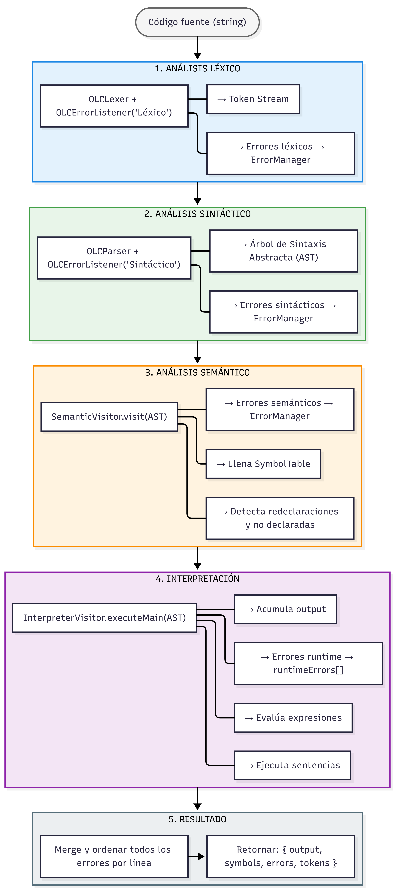

# Documentación Técnica — Intérprete Golampi

> Lenguaje: **Golampi** · Implementación: **PHP + ANTLR4** · Framework: **Laravel**

---

## Tabla de Contenidos

1. [Gramática Formal de Golampi](#1-gramática-formal-de-golampi)
   - 1.1 [Reglas de Programa y Declaraciones](#11-reglas-de-programa-y-declaraciones)
   - 1.2 [Funciones](#12-funciones)
   - 1.3 [Sentencias](#13-sentencias)
   - 1.4 [Expresiones](#14-expresiones)
   - 1.5 [Tipos y Literales](#15-tipos-y-literales)
   - 1.6 [Tokens / Léxico](#16-tokens--léxico)
2. [Diagrama de Clases](#2-diagrama-de-clases)
3. [Flujo de Procesamiento](#3-flujo-de-procesamiento)
   - 3.1 [Pipeline general](#31-pipeline-general)
   - 3.2 [Análisis Léxico y Sintáctico](#32-análisis-léxico-y-sintáctico)
   - 3.3 [Análisis Semántico y Tabla de Símbolos](#33-análisis-semántico-y-tabla-de-símbolos)
   - 3.4 [Interpretación](#34-interpretación)
4. [Estructura de la Tabla de Símbolos](#4-estructura-de-la-tabla-de-símbolos)

---

## 1. Gramática Formal de Golampi

La gramática está definida en notación **EBNF** equivalente a la gramática ANTLR4 (`OLC.g4`).  
Los terminales se escriben en `MAYÚSCULAS` o entre comillas `'...'`.

---

### 1.1 Reglas de Programa y Declaraciones

```ebnf
program
    : declaration* EOF
    ;

declaration
    : functionDcl
    | varDcl
    | shortVarDcl
    | constDcl
    | assignmentStmt
    | ifStmt
    | forStmt
    | switchStmt
    | returnStmt
    | breakStmt
    | continueStmt
    | exprStmt
    ;

block
    : '{' declaration* '}'
    ;
```

---

### 1.2 Funciones

```ebnf
functionDcl
    : 'func' IDENTIFIER '(' params? ')' returnType? block
    ;

params
    : param (',' param)*
    ;

param
    : IDENTIFIER type
    ;

returnType
    : type
    | '(' type (',' type)+ ')'
    ;

varDcl
    : 'var' id_list type ('=' exp_list)?
    ;

shortVarDcl
    : id_list ':=' exp_list
    ;

constDcl
    : 'const' IDENTIFIER type '=' expression
    ;

id_list
    : IDENTIFIER (',' IDENTIFIER)*
    ;

exp_list
    : expression (',' expression)*
    ;
```

---

### 1.3 Sentencias

```ebnf
assignmentStmt
    : primaryExpr ('++'  | '--')
    | primaryExpr assignOp expression
    ;

assignOp
    : '=' | '+=' | '-=' | '*=' | '/='
    ;

ifStmt
    : 'if' simpleStmt? expression block
      ('else' (ifStmt | block))?
    ;

simpleStmt
    : shortVarDcl
    | assignmentStmt
    ;

forStmt
    : 'for' forClause block
    | 'for' expression  block
    | 'for'             block
    ;

forClause
    : simpleStmt? ';' expression? ';' simpleStmt?
    ;

switchStmt
    : 'switch' expression '{' caseClause* defaultClause? '}'
    ;

caseClause
    : 'case' exp_list ':' declaration*
    ;

defaultClause
    : 'default' ':' declaration*
    ;

returnStmt
    : 'return' exp_list?
    ;

breakStmt    : 'break'    ;
continueStmt : 'continue' ;

exprStmt
    : expression
    ;
```

---

### 1.4 Expresiones

```ebnf
expression
    : logicalOrExpr
    ;

logicalOrExpr
    : logicalAndExpr ('||' logicalAndExpr)*
    ;

logicalAndExpr
    : equalityExpr ('&&' equalityExpr)*
    ;

equalityExpr
    : relationalExpr (('==' | '!=') relationalExpr)*
    ;

relationalExpr
    : additiveExpr (('<' | '<=' | '>' | '>=') additiveExpr)*
    ;

additiveExpr
    : multiplicativeExpr (('+' | '-') multiplicativeExpr)*
    ;

multiplicativeExpr
    : unaryExpr (('*' | '/' | '%') unaryExpr)*
    ;

unaryExpr
    : ('-' | '!') unaryExpr
    | primaryExpr
    ;

primaryExpr
    : primaryExpr '[' expression ']'          /* acceso a arreglo  */
    | primaryExpr '(' exp_list? ')'           /* llamada a función  */
    | fmtPrintlnCall
    | builtinCall
    | arrayLiteral
    | literal
    | IDENTIFIER
    | '(' expression ')'
    | NIL
    ;

fmtPrintlnCall
    : 'fmt' '.' 'Println' '(' exp_list? ')'
    ;

builtinCall
    : ('len' | 'now' | 'substr' | 'typeOf') '(' exp_list? ')'
    ;

arrayLiteral
    : arrayType '{' elementList? '}'
    ;

arrayType
    : '[' expression? ']' type
    ;

elementList
    : element (',' element)*
    ;

element
    : expression
    | arrayLiteral
    | '{' elementList? '}'
    ;
```

---

### 1.5 Tipos y Literales

```ebnf
type
    : 'int32'
    | 'float32'
    | 'bool'
    | 'string'
    | 'rune'
    | '*' type                 /* puntero  */
    | '[' expression? ']' type /* arreglo / slice */
    ;

literal
    : INT_LITERAL
    | FLOAT_LITERAL
    | STRING_LITERAL
    | RUNE_LITERAL
    | TRUE
    | FALSE
    ;
```

---

### 1.6 Tokens / Léxico

```ebnf
/* Palabras reservadas */
FUNC     : 'func'     ;
VAR      : 'var'      ;
CONST    : 'const'    ;
IF       : 'if'       ;
ELSE     : 'else'     ;
FOR      : 'for'      ;
SWITCH   : 'switch'   ;
CASE     : 'case'     ;
DEFAULT  : 'default'  ;
RETURN   : 'return'   ;
BREAK    : 'break'    ;
CONTINUE : 'continue' ;
TRUE     : 'true'     ;
FALSE    : 'false'    ;
NIL      : 'nil'      ;

/* Tipos primitivos */
INT32   : 'int32'   ;
FLOAT32 : 'float32' ;
BOOL    : 'bool'    ;
STRING  : 'string'  ;
RUNE    : 'rune'    ;

/* Literales */
INT_LITERAL    : [0-9]+                              ;
FLOAT_LITERAL  : [0-9]+ '.' [0-9]+                  ;
STRING_LITERAL : '"' (~["\r\n\\] | '\\' .)*  '"'    ;
RUNE_LITERAL   : '\'' (~['\r\n\\] | '\\' .) '\''    ;

/* Identificadores */
IDENTIFIER : [a-zA-Z_] [a-zA-Z0-9_]* ;

/* Operadores y puntuación */
ASSIGN      : '='  ;   PLUS_ASSIGN : '+=' ;
MINUS_ASSIGN: '-=' ;   MUL_ASSIGN  : '*=' ;
DIV_ASSIGN  : '/=' ;   PLUS        : '+'  ;
MINUS       : '-'  ;   STAR        : '*'  ;
SLASH       : '/'  ;   PERCENT     : '%'  ;
EQ          : '==' ;   NEQ         : '!=' ;
LT          : '<'  ;   LE          : '<=' ;
GT          : '>'  ;   GE          : '>=' ;
AND         : '&&' ;   OR          : '||' ;
NOT         : '!'  ;   INC         : '++' ;
DEC         : '--' ;   DECLARE     : ':=' ;
LPAREN      : '('  ;   RPAREN      : ')'  ;
LBRACE      : '{'  ;   RBRACE      : '}'  ;
LBRACKET    : '['  ;   RBRACKET    : ']'  ;
COMMA       : ','  ;   SEMICOLON   : ';'  ;
DOT         : '.'  ;   AMPERSAND   : '&'  ;

/* Ignorados */
WS      : [ \t\r\n]+      -> skip ;
COMMENT : '//' ~[\r\n]*   -> skip ;
BLOCK_COMMENT : '/*' .*? '*/' -> skip ;
```

---

## 2. Diagrama de Clases


## 3. Flujo de Procesamiento

### 3.1 Pipeline General


### 3.2 Análisis Léxico y Sintáctico

```
InputStream::fromString($code)
        │
        ▼
   OLCLexer
   ├─ removeErrorListeners()
   └─ addErrorListener( OLCErrorListener('Léxico') )
        │ Token Stream
        ▼
   CommonTokenStream
        │
        ▼
   OLCParser
   ├─ removeErrorListeners()
   └─ addErrorListener( OLCErrorListener('Sintáctico') )
        │
        ▼
   $tree = $parser->program()     ← AST raíz
        │
        ├─ Errores léxicos    ──► ErrorManager::add('Léxico', ...)
        └─ Errores sintácticos──► ErrorManager::add('Sintáctico', ...)

Formato de error almacenado:
┌──────────────┬──────────────────────────────┬────────┬─────────┐
│ tipo         │ descripcion                  │ linea  │ columna │
├──────────────┼──────────────────────────────┼────────┼─────────┤
│ 'Léxico'     │ "Símbolo no reconocido: @"   │  8     │  28     │
│ 'Sintáctico' │ "Se esperaba '(' (enc: '{')" │  59    │   8     │
└──────────────┴──────────────────────────────┴────────┴─────────┘
```

---

### 3.3 Análisis Semántico y Tabla de Símbolos

```
SemanticVisitor.visit($tree)
        │
        ├─ visitFunctionDcl(ctx)
        │       │
        │       ├─ SymbolTable::add(nombre, 'funcion', 'global', ...)
        │       ├─ scope = nombre_funcion
        │       ├─ Para cada param → SymbolTable::add(param, tipo, scope, ...)
        │       └─ visitChildren(ctx)  ← recorre el bloque
        │
        ├─ visitVarDcl(ctx)
        │       ├─ ¿exists(id, scope)? → ErrorManager::add('Semántico', ...)
        │       └─ SymbolTable::add(id, tipo, scope, null, linea, col)
        │
        ├─ visitShortVarDcl(ctx)
        │       ├─ ¿exists(id, scope)? → ErrorManager::add('Semántico', ...)
        │       └─ SymbolTable::add(id, 'inferred', scope, null, linea, col)
        │
        ├─ visitConstDcl(ctx)
        │       └─ SymbolTable::add(id, tipo, scope, null, linea, col)
        │
        └─ visitPrimaryExpr(ctx)
                ├─ ¿Es IDENTIFIER puro (childCount=1)?
                ├─ ¿El padre es una llamada func(...)? → ignorar
                └─ ¿isDeclared(name)? → ErrorManager::add('Semántico', ...)
```

---

### 3.4 Interpretación

```
InterpreterVisitor.executeMain($tree)
        │
        ▼
  visitProgram($tree)
        │
        ├─ PASADA 1: Registrar funciones
        │     Para cada functionDcl → functions[nombre] = ctx
        │
        └─ PASADA 2: Ejecutar declaraciones
              │
              ▼
        visitFunctionDcl  ──► si nombre === 'main' → ejecutar bloque
              │
              ▼
        visitBlock
              │
              ├─ ¿hasSyntaxErrorOnBlockOpen(línea)? → return (bloque huérfano)
              └─ Para cada declaration → safeVisit(decl)
                        │
                        ├─ Variables:  declareVar → scopeStack[top][name]
                        │             updateSymbolValue → SymbolTable::getRef()
                        │
                        ├─ If/For:    ¿hasSyntaxErrorAt(range)? → return
                        │             safeVisit(condition) → safeVisit(block)
                        │
                        ├─ Return:    returnValue = eval(expr)
                        │             returnSignal = true
                        │
                        ├─ Println:   output += formatValue(expr) + "\n"
                        │
                        └─ Función:   callFunction(name, args)
                                        ├─ pushScope()
                                        ├─ bind params → declareVar
                                        ├─ safeVisit(block)
                                        ├─ writeback punteros si *tipo
                                        └─ popScope() → returnValue

Gestión de errores en runtime:
  safeVisit($ctx)
     ├─ $ctx === null → return $fallback  (sin excepción)
     └─ catch Throwable → runtimeErrors[] += { 'Semántico', msg, 0, 0 }
```

---

## 4. Estructura de la Tabla de Símbolos

La `SymbolTable` es una lista plana de registros. Cada registro representa un identificador declarado en el programa.

### Esquema de un registro

| Campo     | Tipo     | Descripción                                              |
|-----------|----------|----------------------------------------------------------|
| `id`      | `string` | Nombre del identificador                                 |
| `type`    | `string` | Tipo declarado: `int32`, `float32`, `bool`, `string`, `rune`, `[N]tipo`, `funcion`, `inferred` |
| `scope`   | `string` | Ámbito donde fue declarado: `global` o nombre de función |
| `value`   | `string\|null` | Valor en tiempo de ejecución (actualizado por el intérprete) |
| `line`    | `int`    | Línea de declaración en el código fuente                 |
| `column`  | `int`    | Columna de declaración en el código fuente               |

### Ejemplo de tabla generada

```
┌────┬─────────────────┬──────────┬─────────────────┬──────────────┬──────┬────────┐
│ #  │ id              │ type     │ scope           │ value        │ line │ column │
├────┼─────────────────┼──────────┼─────────────────┼──────────────┼──────┼────────┤
│  1 │ main            │ funcion  │ global          │ null         │    1 │      0 │
│  2 │ contador        │ int32    │ main            │ 0            │   14 │      4 │
│  3 │ nombre          │ string   │ main            │ "Golampi"    │   15 │      4 │
│  4 │ activo          │ bool     │ main            │ true         │   16 │      4 │
│  5 │ MAX             │ int32    │ main            │ 100          │   17 │      4 │
│  6 │ salario         │ inferred │ main            │ 2500         │   18 │      4 │
│  7 │ arreglo         │ [3]int32 │ main            │ [10 20 30]   │   20 │      4 │
│  8 │ calcular        │ funcion  │ global          │ null         │   25 │      0 │
│  9 │ a               │ int32    │ calcular        │ null         │   25 │     14 │
│ 10 │ b               │ int32    │ calcular        │ null         │   25 │     22 │
│ 11 │ temp            │ int32    │ calcular        │ null         │   26 │      4 │
└────┴─────────────────┴──────────┴─────────────────┴──────────────┴──────┴────────┘
```

### Reglas de búsqueda en la tabla

```
isDeclared(name, currentScope):
    1. ¿name ∈ builtins?  → true        (len, now, substr, typeOf, true, false, nil)
    2. ¿exists(name, currentScope)?  → true
    3. ¿exists(name, 'global')?      → true
    4. → false  (error semántico: variable no declarada)

exists(id, scope):
    Busca entrada exacta donde symbols[i].id === id AND symbols[i].scope === scope

existsAnyScope(id, scope):
    Busca donde symbols[i].id === id AND
        (symbols[i].scope === scope OR symbols[i].scope === 'global')
```

### Actualización de valores en runtime

El `InterpreterVisitor` actualiza los valores directamente en la tabla mediante `getRef()`:

```
updateSymbolValue(name, value):
    symbols = &SymbolTable::getRef()          ← referencia directa al array
    Recorre de atrás hacia adelante
    Primer match de symbols[i].id === name
        → symbols[i].value = formatValue(value)
```

Esto permite que la vista de reportes muestre los valores reales después de la ejecución, no solo los valores iniciales registrados por el análisis semántico.

---

*Documentación generada para el intérprete Golampi — OLC2 2025*